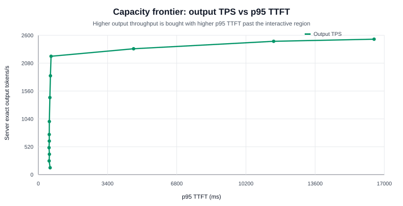
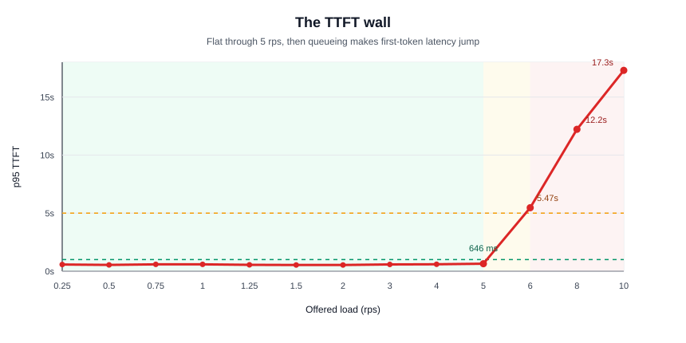
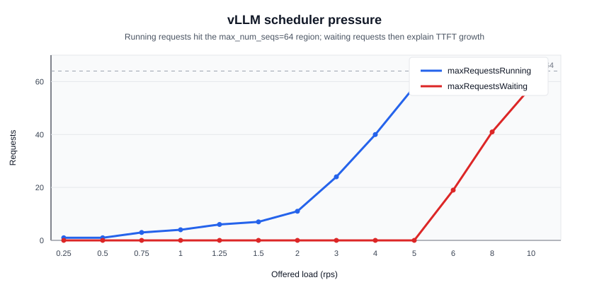
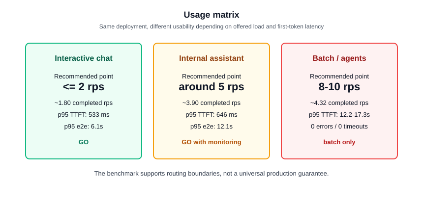
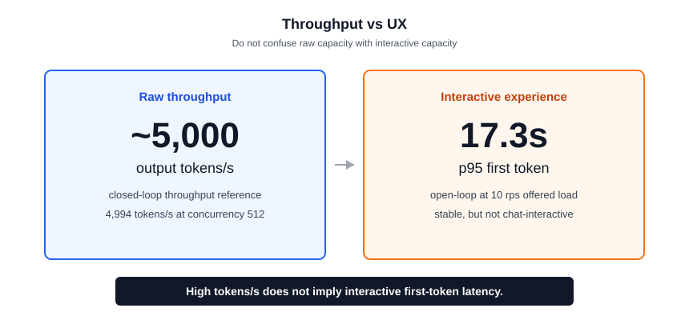
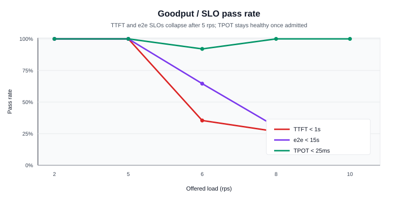
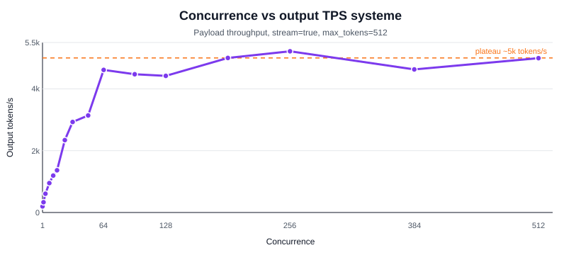
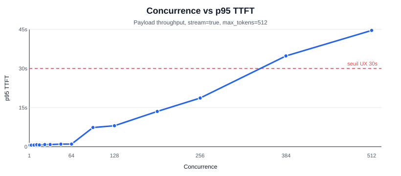
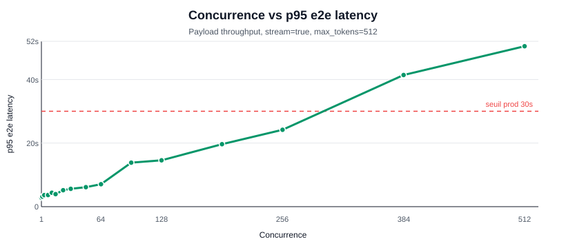

# Nemotron 3 Nano sur vLLM : benchmark de readiness production sur 2 GPU

Langues : [English](README.md) | [Francais](README.fr.md)

Ce depot publie un benchmark de readiness production sanitise pour
`nvidia/NVIDIA-Nemotron-3-Nano-30B-A3B-BF16`, servi par vLLM sur un
deploiement a 2 GPU.

L'objectif n'est pas de classer la qualite des modeles. L'objectif est de
repondre a une question de serving :

> Sous une charge streaming a contexte court et sortie longue, ou ce
> deploiement reste-t-il interactif, ou devient-il utilisable en interne,
> et ou bascule-t-il en mode batch uniquement ?

Les endpoints de service internes, namespaces Kubernetes, noms d'hotes
prives, chemins locaux, credentials, bearer tokens et corps de reponses
generes par le modele ont ete retires de ce package public.

## TL;DR

GO controle pour la charge benchmarkee.

- Le chat interactif est supporte jusqu'a environ `2 rps` de charge
  offerte, avec `~1.80 requetes terminees/s`, un p95 TTFT de `533 ms`,
  un p95 e2e de `6.1s` et `0%` d'erreurs.
- L'usage interne a haut debit reste praticable autour de `5 rps` de
  charge offerte, avec un p95 TTFT de `646 ms`, un p95 e2e de `12.1s` et
  `~1992 tokens de sortie/s` observes cote client.
- La principale frontiere de file d'attente apparait entre `5` et
  `6 rps` : les requetes inflight observees passent de `61` a `93`,
  tandis que `maxRequestsRunning` cote serveur atteint la zone configuree
  `max_num_seqs=64` et que `maxRequestsWaiting` passe de `0` a `19`.
- Le deploiement reste stable a `10 rps` de charge offerte avec `0%`
  d'erreurs et `0` timeout, mais le p95 TTFT atteint `17.3s`, ce qui en
  fait une capacite batch plutot qu'une capacite interactive.
- Le goulot a forte charge offerte est la file d'attente avant le premier
  token, pas la vitesse de decode par token : le p95 ITL reste autour de
  `24-25 ms` a `6-10 rps`, alors que le TTFT augmente fortement.

## Decision

**GO controle** pour ce deploiement vLLM 2 GPU specifique, sous la charge
streaming benchmarkee a contexte court et forte generation.

Utiliser ce resultat pour :

- dimensionner le trafic interactif pres de la zone de charge offerte
  `2 rps` ;
- router le trafic d'assistant interne tolerant pres de la zone de charge
  offerte `5 rps` ;
- traiter `8-10 rps` de charge offerte comme capacite batch / jobs agents
  lorsque plusieurs secondes de TTFT sont acceptables.

Ne pas utiliser ce resultat pour affirmer :

- un serving interactif a `10 rps` ;
- une readiness interactive en contexte long ;
- une superiorite de qualite modele ;
- un comportement d'autoscaling multi-tenant ;
- une parite de cout avec des APIs hebergees ;
- une generalisation a d'autres GPU, versions de vLLM, revisions de
  modele ou parametres de serving.

## Enveloppe operationnelle

| Classe de charge | Point operationnel recommande | Evidence client | Evidence serveur | Lecture production |
| --- | ---: | --- | --- | --- |
| Chat interactif | `<= 2 rps` de charge offerte, `~1.80 rps terminees` observees | p95 TTFT `533 ms`, p95 e2e `6.1s`, `100%` TTFT < `1s` | max running `11`, max waiting `0` | GO |
| Assistant interne haut debit | autour de `5 rps` de charge offerte, `~3.90 rps terminees` observees | p95 TTFT `646 ms`, p95 e2e `12.1s`, `~1992 tokens de sortie/s` | max running `58`, max waiting `0` | GO avec monitoring |
| Frontiere de file d'attente | entre `5` et `6 rps` de charge offerte | p95 TTFT de `646 ms` a `5.47s` ; p95 e2e monte a `16.1s` | max running atteint `64` ; max waiting monte a `19` | controle d'admission recommande |
| Batch / jobs agents | `8-10 rps` de charge offerte | `0%` erreurs, p95 TTFT `12.2-17.3s`, output TPS `~2203-2205` | max running `64` ; max waiting `41-58` ; throttling actif `0` | batch uniquement |

## Constat principal

Ce deploiement n'est pas un service de chat interactif a `10 rps`. C'est
une configuration de serving vLLM stable sur 2 GPU avec une enveloppe
operationnelle claire :

1. Jusqu'a `2 rps` de charge offerte : la latence interactive reste
   solide.
2. Autour de `5 rps` de charge offerte : le debit est eleve et le TTFT
   reste sous `1s` en p95.
3. Entre `5` et `6 rps` : la file d'attente devient le facteur dominant.
4. A `8-10 rps` : le systeme reste stable, mais la charge est uniquement
   batch parce que les utilisateurs attendent plusieurs secondes avant le
   premier token.

La nouvelle telemetrie cote serveur confirme cette interpretation. A
`5 rps`, `maxRequestsRunning` vaut `58` et `maxRequestsWaiting` vaut `0`.
A `6 rps`, `maxRequestsRunning` atteint `64` et `maxRequestsWaiting`
devient `19`. A `10 rps`, `maxRequestsRunning` reste plafonne a `64`
tandis que `maxRequestsWaiting` atteint `58`.

C'est le mur operationnel : une fois la pression de requetes au-dessus de
la zone de capacite de serving, vLLM continue a servir sans erreurs, mais
les requetes supplementaires attendent avant le premier token.

## Evidence visuelle

Les graphiques ci-dessous sont generes a partir des fichiers CSV
sanitises inclus dans ce depot. Ils servent a rendre la frontiere
operationnelle plus facile a inspecter avant les tableaux detailles.

La frontiere de capacite montre le compromis principal : apres la zone
`5 rps` de charge offerte, le debit de sortie observe cote client
n'augmente que modestement tandis que le p95 TTFT grimpe fortement.

Le mur TTFT est la lecture de latence la plus simple : le p95 TTFT est
presque plat jusqu'a `5 rps`, puis saute a `6 rps` et continue de monter
a `8-10 rps`.

Le graphique scheduler donne l'explication serveur la plus claire. A
`5 rps`, vLLM n'a toujours pas de file d'attente observee. A `6 rps`, les
requetes running atteignent la zone `max_num_seqs=64` et les requetes en
attente apparaissent.

La matrice d'usage transforme le benchmark en guide de routage : chat
interactif, trafic d'assistant interne tolerant et batch / jobs agents ne
doivent pas partager les memes attentes de latence.

Le graphique debit-vs-UX garde visible la mise en garde principale : un
nombre eleve de tokens/s bruts n'implique pas une latence interactive du
premier token sous charge saturee.

Le graphique goodput montre pourquoi il ne s'agit pas principalement d'un
probleme de vitesse de decode : TPOT reste sain a forte charge offerte,
tandis que les taux de passage TTFT et end-to-end chutent apres la
frontiere de file d'attente.

Graphiques de reference en closed-loop

## Elements cles

Source : [`data/request-rate-combined-summary.csv`](data/request-rate-combined-summary.csv)

| RPS offert | RPS terminees | Max inflight | p95 TTFT | p95 e2e | TPS sortie client | Taux erreur | Lecture |
| ---: | ---: | ---: | ---: | ---: | ---: | ---: | --- |
| 2 | 1.7979 | 13 | 533 ms | 6111 ms | 880.7 | 0% | interactif |
| 5 | 3.9044 | 61 | 646 ms | 12119 ms | 1992.0 | 0% | interne haut debit |
| 6 | 3.7836 | 93 | 5466 ms | 16121 ms | 1930.9 | 0% | debut de file d'attente |
| 8 | 4.3238 | 133 | 12219 ms | 21588 ms | 2203.5 | 0% | tendance batch |
| 10 | 4.3194 | 169 | 17306 ms | 26761 ms | 2205.3 | 0% | batch uniquement |

Important : le benchmark a genere jusqu'a `10 rps` de charge offerte.
Sous cette charge, le deploiement a termine environ `4.32 requetes/s`
avec `0%` d'erreurs et `0` timeout, mais le p95 TTFT a atteint `17.3s`.

## Evidence cote serveur

Source : [`data/server-metrics-deltas.csv`](data/server-metrics-deltas.csv)

Les metriques serveur ont ete collectees via un scrape d'API Prometheus
authentifie pendant le benchmark. Le scrape incluait les metriques
scheduler vLLM, les compteurs vLLM de latence/tokens, la telemetrie GPU
DCGM et les metriques de throttling nvidia-smi.

| RPS offert | Max running | Max waiting | TTFT serveur moyen | e2e serveur moyen | ITL serveur moyen | Util GPU max | Puissance max | VRAM utilisee | Throttle actif |
| ---: | ---: | ---: | ---: | ---: | ---: | ---: | ---: | ---: | ---: |
| 2 | 11 | 0 | 0.060s | 5.49s | 10.6 ms | 100% | 711 W | 178242 MiB | 0 |
| 5 | 58 | 0 | 0.095s | 10.73s | 20.8 ms | 100% | 688 W | 178242 MiB | 0 |
| 6 | 64 | 19 | 1.948s | 13.49s | 22.6 ms | 97.5% | 628 W | 178242 MiB | 0 |
| 8 | 64 | 41 | 5.174s | 16.41s | 22.0 ms | 100% | 681 W | 178242 MiB | 0 |
| 10 | 64 | 58 | 7.606s | 18.95s | 22.2 ms | 100% | 700 W | 178242 MiB | 0 |

Le diagnostic le plus fort est la divergence entre les metriques de file
d'attente et la latence par token :

- `maxRequestsRunning` plafonne a `64`, ce qui correspond a la zone de
  configuration de serving.
- `maxRequestsWaiting` passe de `0` a `5 rps` a `58` a `10 rps`.
- L'ITL serveur moyen reste autour de `22 ms` a forte charge offerte.
- Le throttling nvidia-smi reste inactif dans la telemetrie echantillonnee.

Il s'agit de file d'attente avant le premier token, pas d'un effondrement
de la vitesse de decode.

## Goodput / taux de passage SLO

Source : [`data/goodput-slo-summary.csv`](data/goodput-slo-summary.csv)

Les seuils ci-dessous sont des SLO production illustratifs, pas des
exigences de latence universelles.

| RPS offert | RPS terminees | Sans erreur | TTFT < 1s | TTFT < 5s | TPOT < 25ms | e2e < 15s | Lecture |
| ---: | ---: | ---: | ---: | ---: | ---: | ---: | --- |
| 2 | 1.7979 | 100% | 100% | 100% | 100% | 100% | interactif |
| 5 | 3.9044 | 100% | 100% | 100% | 100% | 100% | interne haut debit |
| 6 | 3.7836 | 100% | 35.42% | 88.75% | 92.08% | 64.58% | debut de file d'attente |
| 8 | 4.3238 | 100% | 26.67% | 53.33% | 100% | 30.42% | tendance batch |
| 10 | 4.3194 | 100% | 26.67% | 31.25% | 100% | 26.67% | batch uniquement |

Le diagnostic le plus important est que les SLO TTFT et e2e s'effondrent
avant TPOT. Le systeme peut encore decoder des tokens regulierement une
fois une requete admise, mais beaucoup de requetes attendent trop
longtemps avant admission.

## Methodologie

| Champ | Valeur |
| --- | --- |
| Date du run | 2026-06-03 |
| Mode benchmark | balayage open-loop du taux de requetes |
| Type d'endpoint | endpoint streaming compatible OpenAI |
| Charge | prompt court, generation longue, decode-heavy |
| Modele | `nvidia/NVIDIA-Nemotron-3-Nano-30B-A3B-BF16` |
| Snapshot modele | `cbd3fa9f933d55ef16a84236559f4ee2a0526848` |
| Max output tokens | `512` |
| Longueur moyenne generee | environ `512` tokens de sortie par requete terminee sur les niveaux haut debit |
| Niveaux request-rate | `0.25, 0.5, 0.75, 1, 1.25, 1.5, 2, 3, 4, 5, 6, 8, 10 rps` |
| Requetes mesurees | `2310` |
| Warmup | `3` requetes de warmup, exclues des totaux mesures |
| Duree par niveau | `120000 ms` ou fin par limite de requetes, selon le premier atteint |
| Cooldown entre niveaux | `60000 ms` |
| Sampling | `temperature=0`, `top_p=1` |
| Mode reasoning | `enable_thinking=false` |
| Streaming | `true` |
| Timeout | `120000 ms` |
| Telemetrie serveur | scrape API Prometheus authentifie toutes les `2000 ms` |
| Runtime serveur | vLLM `0.21.0`, PyTorch `2.11.0+cu130`, driver NVIDIA `595.58.03`, runtime CUDA `13.2` |
| Hardware serveur | 2 x NVIDIA RTX PRO 6000 Blackwell Server Edition, tensor parallel size `2` |

Le benchmark a ete execute via le meme chemin de serving prive utilise
par les clients internes. Il mesure donc le chemin operationnel, pas un
microbenchmark localhost uniquement.

## Definitions des metriques

| Metrique | Definition |
| --- | --- |
| RPS offert / target RPS | Taux auquel le client open-loop initie de nouvelles requetes. Ce n'est pas la meme chose que le debit termine sous saturation. |
| RPS terminees / actual RPS | Requetes mesurees terminees divisees par le temps ecoule du niveau de benchmark. |
| TTFT | Temps entre le debut de requete et la reception du premier token streame par le client. |
| Latence e2e | Temps entre le debut de requete et la reception du dernier token / de la completion par le client. |
| ITL / TPOT | Latence inter-token, mesuree comme delai moyen entre tokens de sortie successifs pendant le streaming. |
| TPS sortie client | Estimation cote client des tokens de sortie divisee par la duree du benchmark. C'est la lecture de debit principale dans la table request-rate. |
| Server delta output TPS | Delta du compteur vLLM de tokens generes divise par l'intervalle de snapshot Prometheus. Utile pour corroborer, mais son denominateur differe de la duree du benchmark client. |
| `num_requests_running` | Compte scheduler vLLM des requetes activement servies. |
| `num_requests_waiting` | Compte scheduler vLLM des requetes en attente de service. |
| Taux d'erreur | Erreurs HTTP/client plus timeouts divises par les requetes mesurees. |

## Profil serveur et vLLM

Le manifeste public conserve uniquement les metadonnees hardware et
runtime pertinentes pour le benchmark. Il retire les noms d'hotes prives,
chemins, services, credentials et details de deploiement.

| Domaine | Valeur publique du benchmark |
| --- | --- |
| Runtime | vLLM `0.21.0`, PyTorch `2.11.0+cu130`, driver NVIDIA `595.58.03`, runtime CUDA `13.2` |
| GPU | 2 x NVIDIA RTX PRO 6000 Blackwell Server Edition, 97887 MiB VRAM par GPU |
| Parallelisme | tensor parallel `2`, pipeline `1`, data parallel `1` |
| Limites vLLM | `max_model_len=32768`, `max_num_seqs=64`, `gpu_memory_utilization=0.90` |
| Scheduler | async scheduling et chunked prefill actives |
| CPU/RAM | 32 CPU logiques, 251 GiB RAM |

`max_num_seqs=64` est le seuil cle d'interpretation. Le TTFT reste sous
1 seconde tant que la pression observee reste proche ou sous cette zone
de capacite de serving. Une fois la pression au-dessus, vLLM continue a
servir sans erreurs mais introduit une file d'attente avant le premier
token.

## Interpretation operationnelle

Politique de routage recommandee pour cette charge :

- Garder le chat interactif pres de ou sous la zone de charge offerte
  `2 rps`.
- Router les charges d'assistant interne tolerantes autour de la zone de
  charge offerte `5 rps`, avec monitoring de `num_requests_waiting` et du
  p95 TTFT.
- Traiter `8-10 rps` de charge offerte comme capacite batch / jobs agents
  uniquement.
- Utiliser un controle d'admission ou un rate limiter pour proteger le
  trafic interactif lorsque `num_requests_running` approche `64` ou que
  `num_requests_waiting > 0`.
- Ne pas melanger de requetes interactives long contexte dans le meme pool
  sans benchmark separe ; ce run est a contexte court et decode-heavy.

## Limites connues

Ce benchmark fournit une evidence de readiness production pour une charge
et un deploiement. Ce n'est pas un certificat universel de serving.

Limites actuelles :

- pas de soak test de 30-60 minutes ;
- pas de test de charge mixte combinant chat, long contexte, JSON et
  batch ;
- pas de test d'autoscaling multi-tenant ;
- pas de benchmark de latence interactive en contexte long ;
- pas de comparaison de qualite modele contre d'autres modeles ;
- pas d'analyse de parite cout/API ;
- pas de calcul energie par token ou watts par million de tokens ;
- pas de corps de reponses generees brutes en public.

Les rejets proches de 32k en contexte long dans des tests internes plus
larges etaient des rejets de budget serveur, pas des echecs du modele :
`input_tokens + output_tokens` depassait le `max_model_len=32768`
configure.

## Fichiers de donnees

| Chemin | Contenu |
| --- | --- |
| [`data/request-rate-combined-summary.csv`](data/request-rate-combined-summary.csv) | Resume request-rate de `0.25` a `10 rps` pour le run 2026-06-03 avec metriques authentifiees |
| [`data/goodput-slo-summary.csv`](data/goodput-slo-summary.csv) | Taux de passage SLO par niveau calcules depuis les enregistrements de requetes mesurees |
| [`data/server-metrics-deltas.csv`](data/server-metrics-deltas.csv) | Deltas de metriques vLLM/GPU par niveau depuis les scrapes Prometheus authentifies |
| [`data/reference-runs/`](data/reference-runs/) | Annexes sanitisees metriques uniquement pour les runs precedents smoke, qualite, long contexte, stress et throughput closed-loop |
| [`DATA_NOTICE.md`](DATA_NOTICE.md) | Notice de sanitisation et d'inclusion |

Le repertoire `reference-runs` est inclus pour la tracabilite. Il ne
constitue pas le score request-rate principal. Chaque repertoire de run
contient un manifeste public, des metriques agregees, un profil de stress
quand applicable et des enregistrements JSONL metriques uniquement. Les
corps bruts de reponses generees ne sont pas inclus.

## Metriques d'efficience

Les artefacts publics supportent ces lectures simples d'efficience basees
sur le debit de sortie observe cote client :

| Charge offerte | TPS sortie client | GPU | TPS sortie/GPU | RPS terminees/GPU |
| ---: | ---: | ---: | ---: | ---: |
| `2 rps` | `880.7` | 2 | `440.3` | `0.899` |
| `5 rps` | `1992.0` | 2 | `996.0` | `1.952` |
| `10 rps` | `2205.3` | 2 | `1102.6` | `2.160` |

Le cout par million de tokens et les watts par million de tokens ne sont
intentionnellement pas reportes, car l'export public n'inclut pas le cout
materiel amorti ni l'integration energetique.

## Reutilisation des donnees et citation

Ce dataset est publie selon les termes decrits dans [`LICENSE`](LICENSE).
Les metadonnees de citation sont fournies dans [`CITATION.cff`](CITATION.cff).
