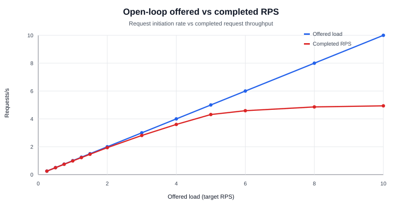
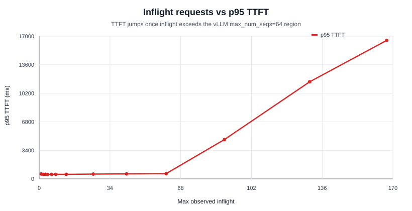
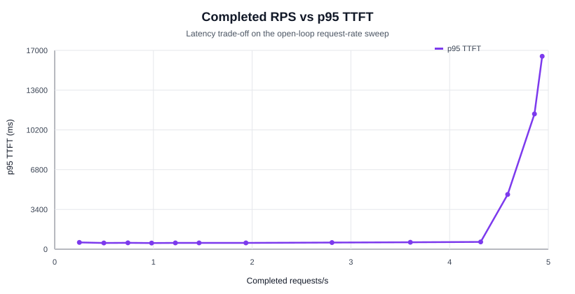

# Nemotron 3 Nano Production-Readiness Benchmark

Public README derived from the internal report
`2026-06-02-nemotron-prod-readiness-benchmark.md`.

This repository contains a sanitized export of the June 2, 2026
production-readiness benchmark for
`nvidia/NVIDIA-Nemotron-3-Nano-30B-A3B-BF16` served by vLLM.

Internal service endpoints, Kubernetes namespaces, private hostnames,
local filesystem paths, credentials, and generated response bodies were
removed from this public package. The remaining files are benchmark
metrics, public manifests, aggregate tables, and charts.

## Benchmark Claim

This benchmark provides production-readiness evidence for Nemotron 3 Nano
on this specific 2-GPU vLLM deployment under short-context, decode-heavy
streaming workloads with `max_tokens=512`.

It does not prove that Nemotron 3 Nano is the best model. It shows that,
on this 2-GPU vLLM stack and for a short-input / long-output workload,
the model can be operated stably, with a clear operational boundary
between interactive usage, tolerant internal usage, and batch capacity.

Under this benchmark scope, the results support:

- interactive chat up to around `2 rps` offered load, with approximately
  `1.94 completed requests/s`;
- internal assistant / tolerant UX usage up to around `6 rps` offered load, with
  approximately `4.59 completed requests/s`;
- batch-style offered load up to `10 rps`, with approximately
  `4.94 completed requests/s`, `0%` observed errors, and `0` timeouts.

It does not claim:

- universal model quality superiority;
- long-context interactive performance;
- multi-tenant autoscaling behavior;
- cost parity with hosted APIs;
- generalization to different GPUs, vLLM versions, model revisions, or
  serving parameters.

## Executive Summary

Current decision: controlled GO for Nemotron 3 Nano served by vLLM on the
observed internal model-serving path.

The open-loop request-rate sweep generated offered load from `0.25` to
`10 rps`. It completed `2310/2310` measured requests with `0` errors and
`0` timeouts. At the highest offered load, the deployment completed
approximately `4.94 requests/s`; p95 TTFT reached `16.5s`, making that
level suitable for batch-style workloads rather than interactive usage.

The limiting factor is user-facing latency, especially
time-to-first-token (TTFT), once observed inflight requests exceed the
configured vLLM sequence capacity.

The main inflection point is between `5` and `6 rps`:

| Target RPS | Max inflight | p95 TTFT | p95 e2e | Interpretation |
| ---: | ---: | ---: | ---: | --- |
| `5 rps` | 61 | 625 ms | 12073 ms | healthy internal/premium boundary |
| `6 rps` | 89 | 4679 ms | 15495 ms | visible queueing, still stable |
| `8 rps` | 130 | 11563 ms | 20942 ms | batch-oriented |
| `10 rps` | 167 | 16497 ms | 25948 ms | stable, non-interactive UX |

The server-side exact output throughput reaches approximately
`2528 output tokens/s`, or about `1264 output tokens/s/GPU`, at
`10 rps` offered load in this open-loop workload. Earlier closed-loop
runs observed a higher throughput plateau around `5.2k output tokens/s`,
but those runs answer a different concurrency question than the
request-rate sweep published here.

## Reader Takeaway

For this workload, the deployment behaves as follows:

- below `2 rps` offered load: interactive latency is strong;
- around `5 rps` offered load: throughput is high and p95 TTFT remains
  below `1s`;
- between `5` and `6 rps` offered load: queueing becomes visible;
- above `8 rps` offered load: the system remains stable but should be
  treated as batch capacity, not chat capacity.

## SLA Reading

| Usage | Recommended ceiling | Observed capacity | Reason |
| --- | ---: | ---: | --- |
| Interactive chat | `<= 2 rps` offered load, `~1.94 completed requests/s` observed | `~992 output tokens/s exact` | p95 TTFT around 541 ms, p95 e2e around 6.2 s |
| Internal assistant / tolerant UX | `<= 6 rps` offered load, `~4.59 completed requests/s` observed | `~2349 output tokens/s exact` | p95 TTFT 4.7 s, p95 e2e 15.5 s, 0 errors |
| Batch / agent jobs | `<= 10 rps` offered load, `~4.94 completed requests/s` observed | `~2528 output tokens/s exact` | 0 errors, but non-interactive TTFT at 8-10 rps |

Do not describe this result as "`10 rps interactive`". A more accurate
public wording is:

> The benchmark generated up to `10 rps` of offered load. Under this
> load, the deployment completed approximately `4.94 requests/s` with
> `0%` errors and `0` timeouts, but p95 TTFT reached `16.5s`, making
> this level suitable for batch-style workloads rather than interactive
> usage.

## Methodology

| Field | Value |
| --- | --- |
| Run date | 2026-06-02 |
| Benchmark mode | open-loop request-rate sweep |
| Endpoint type | OpenAI-compatible streaming endpoint |
| Workload | short prompt, long generation, decode-heavy |
| Model | `nvidia/NVIDIA-Nemotron-3-Nano-30B-A3B-BF16` |
| Model snapshot | `cbd3fa9f933d55ef16a84236559f4ee2a0526848` |
| Max output tokens | `512` |
| Average generated output length | approximately `512` output tokens per completed request across the high-rate levels |
| Request-rate levels | `0.25, 0.5, 0.75, 1, 1.25, 1.5, 2, 3, 4, 5, 6, 8, 10 rps` |
| Measured requests | `2310` |
| Warmup | `3` warmup requests per benchmark run, excluded from measured totals |
| Duration per level | `120000 ms` |
| Cooldown between levels | `60000 ms` |
| Sampling | `temperature=0`, `top_p=1` |
| Reasoning mode | `enable_thinking=false` |
| Streaming | `true` |
| Timeout | `120000 ms` |
| Client environment | containerized benchmark runner on the same private serving path; private infrastructure details removed |
| Server runtime | vLLM `0.21.0`, PyTorch `2.11.0+cu130`, NVIDIA driver `595.58.03`, CUDA runtime `13.2` |
| Server hardware | 2 x NVIDIA RTX PRO 6000 Blackwell Server Edition, tensor parallel size `2` |

The public artifacts do not include a fixed random seed, `ignore_eos`,
client CPU/RAM allocation, or continuous GPU telemetry. Those are listed
as limitations and should be captured in the next benchmark run.

## Metric Definitions

| Metric | Definition |
| --- | --- |
| Offered RPS / target RPS | Rate at which the open-loop client initiates new requests. It is not the same as completed throughput under saturation. |
| Completed RPS / actual RPS | Completed measured requests divided by elapsed benchmark time for the level. |
| TTFT | Time from request start until the first streamed token is received by the client. |
| e2e latency | Time from request start until the final token / completion is received by the client. |
| ITL / TPOT | Inter-token latency, measured as average delay between successive output tokens during streaming. |
| Client output TPS | Client-side output token estimate divided by benchmark duration. |
| Server exact output TPS | Output token throughput from vLLM server-side token counters captured through metrics snapshots. |
| Error rate | HTTP/client errors plus timeouts divided by measured requests. |

## Main Request-Rate Results

Source: [`data/request-rate-combined-summary.csv`](data/request-rate-combined-summary.csv)

| Target RPS | Actual RPS | Max inflight | p95 TTFT | p95 e2e | Client output TPS | Server exact output TPS | Error rate |
| ---: | ---: | ---: | ---: | ---: | ---: | ---: | ---: |
| 0.25 | 0.25 | 1 | 579 ms | 3123 ms | 120.75 | 128.0 | 0% |
| 0.5 | 0.498 | 2 | 531 ms | 2840 ms | 243.42 | 255.0 | 0% |
| 0.75 | 0.741 | 3 | 544 ms | 3129 ms | 358.71 | 379.6 | 0% |
| 1 | 0.981 | 4 | 526 ms | 3886 ms | 481.09 | 502.5 | 0% |
| 1.25 | 1.222 | 6 | 538 ms | 4608 ms | 594.28 | 625.9 | 0% |
| 1.5 | 1.462 | 8 | 536 ms | 4983 ms | 713.91 | 748.6 | 0% |
| 2 | 1.936 | 13 | 541 ms | 6176 ms | 948.67 | 991.5 | 0% |
| 3 | 2.808 | 26 | 568 ms | 8447 ms | 1422.03 | 1437.9 | 0% |
| 4 | 3.602 | 42 | 593 ms | 10331 ms | 1839.85 | 1844.4 | 0% |
| 5 | 4.315 | 61 | 625 ms | 12073 ms | 2201.65 | 2209.2 | 0% |
| 6 | 4.588 | 89 | 4679 ms | 15495 ms | 2351.91 | 2349.0 | 0% |
| 8 | 4.860 | 130 | 11563 ms | 20942 ms | 2483.58 | 2488.2 | 0% |
| 10 | 4.938 | 167 | 16497 ms | 25948 ms | 2523.08 | 2528.0 | 0% |

## Goodput / SLO Pass Rate

Source: [`data/goodput-slo-summary.csv`](data/goodput-slo-summary.csv)

The table below is computed from per-request measured records after
removing warmup requests. It reports the share of requests that meet
simple production SLO thresholds. The thresholds are illustrative
production SLOs, not universal latency requirements.

| Offered RPS | Completed RPS | Measured requests | Error-free | TTFT < 1s | TTFT < 5s | e2e < 15s | e2e < 30s |
| ---: | ---: | ---: | ---: | ---: | ---: | ---: | ---: |
| 2 | 1.936 | 240 | 100% | 100% | 100% | 100% | 100% |
| 5 | 4.315 | 240 | 100% | 100% | 100% | 100% | 100% |
| 6 | 4.588 | 240 | 100% | 40.42% | 100% | 81.25% | 100% |
| 10 | 4.938 | 240 | 100% | 26.67% | 31.67% | 26.67% | 100% |

The SLO interpretation is clear: the deployment remains error-free at
high offered load, but the interactive SLO collapses once queueing
dominates. At `10 rps` offered load, the result is stable batch
throughput, not interactive latency.

## Server And vLLM Profile

The public manifest keeps only benchmark-relevant hardware and runtime
metadata. It removes private hostnames, paths, services, credentials, and
deployment details.

| Domain | Public benchmark value |
| --- | --- |
| Runtime | vLLM `0.21.0`, PyTorch `2.11.0+cu130`, NVIDIA driver `595.58.03`, CUDA runtime `13.2` |
| GPUs | 2 x NVIDIA RTX PRO 6000 Blackwell Server Edition, 97887 MiB VRAM per GPU |
| Parallelism | tensor parallel `2`, pipeline `1`, data parallel `1` |
| vLLM limits | `max_model_len=32768`, `max_num_seqs=64`, `gpu_memory_utilization=0.90` |
| Scheduler | async scheduling and chunked prefill enabled |
| CPU/RAM | 32 logical CPUs, 251 GiB RAM |

`max_num_seqs=64` is the key interpretation threshold. TTFT stays below
1 second while observed inflight requests remain near or below this
limit. Once inflight requests exceed it substantially, vLLM keeps serving
without errors but introduces queueing before the first token.

## Operational Interpretation

The practical production reading is:

- keep strict interactive routing near or below `2 rps` completed
  throughput for this workload;
- allow tolerant internal traffic up to about `6 rps` offered load only
  if multi-second TTFT is acceptable;
- treat `8-10 rps` offered load as batch-style traffic;
- apply a rate limiter or admission controller to keep interactive
  traffic near or below the `max_num_seqs=64` region;
- route long-context workloads into a separate pool or capacity class,
  because this benchmark is short-context and decode-heavy.

## Open-Loop Charts

These charts correspond to the primary request-rate sweep.

## Closed-Loop Appendix Charts

These charts come from the companion closed-loop throughput sweep. They
are included because they contextualize the throughput plateau mentioned
in the internal report. The primary public request-rate data is the CSV
and stress profiles under `data/`.

## Data Files

| Path | Content |
| --- | --- |
| [`data/request-rate-combined-summary.csv`](data/request-rate-combined-summary.csv) | Combined request-rate summary from `0.25` to `10 rps` |
| [`data/goodput-slo-summary.csv`](data/goodput-slo-summary.csv) | Per-level SLO pass rates computed from measured request records |
| [`data/baseline-request-rate/manifest.public.json`](data/baseline-request-rate/manifest.public.json) | Public manifest for `0.25` to `2 rps` |
| [`data/baseline-request-rate/metrics.json`](data/baseline-request-rate/metrics.json) | Aggregate benchmark metrics for baseline run |
| [`data/baseline-request-rate/stress-profile.csv`](data/baseline-request-rate/stress-profile.csv) | Per-level stress profile for baseline run |
| [`data/baseline-request-rate/stress-results.metrics-only.jsonl`](data/baseline-request-rate/stress-results.metrics-only.jsonl) | Per-request metrics with generated content removed |
| [`data/baseline-request-rate/server-metrics.public.jsonl`](data/baseline-request-rate/server-metrics.public.jsonl) | Public server metric snapshots with endpoint removed |
| [`data/high-request-rate/manifest.public.json`](data/high-request-rate/manifest.public.json) | Public manifest for `3` to `10 rps` |
| [`data/high-request-rate/metrics.json`](data/high-request-rate/metrics.json) | Aggregate benchmark metrics for high-rate run |
| [`data/high-request-rate/stress-profile.csv`](data/high-request-rate/stress-profile.csv) | Per-level stress profile for high-rate run |
| [`data/high-request-rate/stress-results.metrics-only.jsonl`](data/high-request-rate/stress-results.metrics-only.jsonl) | Per-request metrics with generated content removed |
| [`data/high-request-rate/server-metrics.public.jsonl`](data/high-request-rate/server-metrics.public.jsonl) | Public server metric snapshots with endpoint removed |
| [`data/reference-runs/`](data/reference-runs/) | Sanitized metrics-only appendices for smoke, quality, long-context, stress, and closed-loop throughput runs cited by the source report |
| [`DATA_NOTICE.md`](DATA_NOTICE.md) | Sanitization and inclusion notice |

The `reference-runs` directory is included for traceability. It is not
the primary request-rate score. Each run directory contains a public
manifest, aggregate metrics, stress profile when applicable, and JSONL
metrics-only records. Raw generated response bodies are not included.

## Efficiency Metrics

The public artifacts support these simple efficiency readings:

| Offered load | Server exact output TPS | GPUs | Output TPS/GPU | Completed RPS/GPU |
| ---: | ---: | ---: | ---: | ---: |
| `2 rps` | `991.5` | 2 | `495.8` | `0.968` |
| `6 rps` | `2349.0` | 2 | `1174.5` | `2.294` |
| `10 rps` | `2528.0` | 2 | `1264.0` | `2.469` |

Cost per million tokens and watts per million tokens are intentionally
not reported because the public export does not include GPU power,
energy, cloud pricing, or amortized hardware cost data.

## Known Limitations

The request-rate workload is decode-heavy: each high-rate request used a
short prompt and `max_tokens=512`. Conclusions therefore apply most
directly to short-context, long-generation traffic. Long-document
workloads with `8k-30k` input tokens will have a different TTFT profile.

Current limitations:

- no continuous intra-level server scrape;
- no GPU telemetry in the public dataset;
- no 30-60 minute soak test;
- no mixed workload test combining chat, long-context, JSON, and batch;
- no multi-tenant autoscaling test;
- no long-context interactive latency benchmark;
- no cost/API parity analysis;
- no energy, temperature, clock, or throttling measurements;
- no fixed seed or client resource allocation captured in the public
  artifacts.

Near-32k long-context rejections in the broader benchmark were server
budget rejections, not model failures: `input_tokens + output_tokens`
exceeded the configured `max_model_len=32768`.

## Next Benchmark Roadmap

The next run should add continuous observability and richer production
coverage:

- scrape vLLM `/metrics` every `1-2s` during each level, including
  `num_requests_waiting`, `request_queue_time`, `kv_cache_usage_perc`,
  `num_preemptions`, TTFT histograms, TPOT/ITL, and e2e latency;
- collect GPU telemetry through DCGM or equivalent: utilization, VRAM
  used, power draw, temperature, clocks, throttling, and energy;
- add open-loop charts and tables for p99, not only p95;
- run a 30-60 minute soak at the recommended interactive and batch
  ceilings;
- add mixed workloads and long-context interactive cases;
- publish cost per million output tokens and watts per million output
  tokens if the underlying cost and power data can be shared.

## Public-Safety Scope

This export intentionally excludes:

- API keys, bearer tokens, Kubernetes secrets, and credentials.
- Internal service URLs, cluster namespaces, private hostnames, and local
  filesystem paths.
- Kubernetes manifests, deployment files, and codebase source files.
- Generated model response bodies from raw stress JSONL files.

The package is meant to be published as benchmark evidence, not as an
operational runbook for the private infrastructure used to run it.
